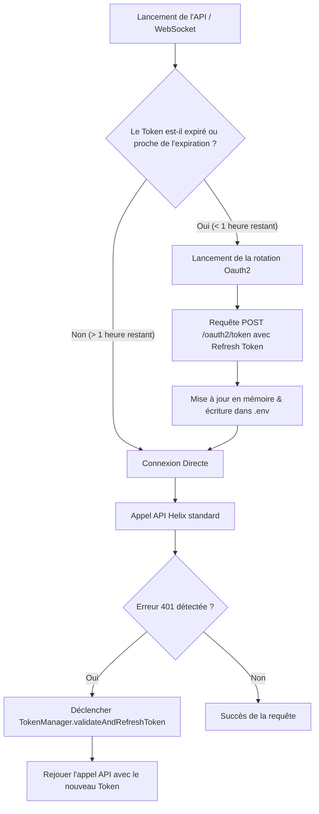

# 🔑 Manuel de Gestion & de Rotation Automatique des Tokens OAuth (Cas d'école : Twitch Helix & EventSub)

Ce manuel a été rédigé pour documenter la logique d'authentification robuste de **BigBrozer** permettant de faire tourner des services d'écoute et de scan en tâche de fond 24h/24 et 7j/7 sans aucune intervention humaine.

Il sert de modèle pour d'autres agents d'intelligence artificielle ou développeurs souhaitant créer des applications similaires nécessitant des connexions sécurisées et auto-renouvelables avec des APIs tierces (Twitch, Spotify, Discord, YouTube, Google Cloud, etc.).

---

## 🏗️ Architecture Globale de la Persistance & Sécurité

Pour maintenir une intégration résiliente, la gestion des tokens repose sur 3 piliers essentiels :
1. **La Validation Temporelle & Proactive** : Valider régulièrement le token et anticiper sa rotation *avant* qu'il n'expire en session critique.
2. **La Persistance Dynamique** : Enregistrer immédiatement les nouveaux tokens dans le fichier de configuration physique (`.env`) pour qu'en cas de redémarrage ou de plantage du serveur, l'état valide soit conservé.
3. **L'Interception Automatique (Retry Logic)** : Capturer les erreurs `401 Unauthorized` au niveau de la couche réseau, rafraîchir le token de manière transparente, et rejouer la requête d'origine pour l'utilisateur sans qu'il ne s'aperçoive du renouvellement.



---

## 🛠️ Étape 1 : Configuration initiale dans le `.env`

Toute application OAuth2 de type "daemon" ou service autonome doit déclarer 4 variables de configuration cruciales :
```env
# Identifiants de l'Application (obtenus sur la console développeur)
TWITCH_CLIENT_ID=votre_client_id
TWITCH_CLIENT_SECRET=votre_client_secret

# Jetons temporaires de session utilisateur
TWITCH_USER_TOKEN=votre_token_d_acces_actuel
TWITCH_REFRESH_TOKEN=votre_token_de_rafraichissement_longue_duree
```

> [!CAUTION]
> **Le secret client (`TWITCH_CLIENT_SECRET`) et le refresh token (`TWITCH_REFRESH_TOKEN`) sont des données hautement sensibles.** Ne les committez jamais dans Git. Utilisez le fichier `.gitignore` pour protéger le `.env`.

---

## 📂 Étape 2 : Le Gestionnaire de Tokens (`TokenManager`)

Ce module (implémenté dans `tokenManager.js`) centralise toute la logique d'authentification. Il valide le token actuel et gère sa rotation.

### 📝 Implémentation type en JavaScript (Node.js) :

```javascript
const fs = require('fs');
const path = require('path');
const axios = require('axios');

class TokenManager {
    constructor() {
        this.envPath = path.join(__dirname, '.env');
    }

    /**
     * Valide le token actif auprès de l'API de validation OAuth2
     * @returns {Promise<string|null>} Token valide (original ou renouvelé)
     */
    async validateAndRefreshToken() {
        let token = process.env.TWITCH_USER_TOKEN;
        const clientId = process.env.TWITCH_CLIENT_ID;
        const clientSecret = process.env.TWITCH_CLIENT_SECRET;
        const refreshToken = process.env.TWITCH_REFRESH_TOKEN;

        if (!token) return null;
        const cleanToken = token.replace('oauth:', '').trim();

        try {
            // Requête standard de validation Twitch
            const res = await axios.get('https://id.twitch.tv/oauth2/validate', {
                headers: { 'Authorization': `OAuth ${cleanToken}` }
            });

            const expiresIn = res.data.expires_in;
            
            // ANTICIPATION : Si le jeton expire dans moins d'une heure (3600s), on force la rotation
            if (expiresIn < 3600) {
                console.log("⏳ Le token expire dans moins d'une heure. Lancement de la rotation...");
                return await this.refresh(clientId, clientSecret, refreshToken);
            }

            console.log(`🔑 Token valide. Expire dans ${Math.round(expiresIn / 3600)} heures.`);
            return cleanToken;

        } catch (err) {
            if (err.response?.status === 401) {
                console.log("⚠️ Token expiré. Tentative de renouvellement automatique...");
                return await this.refresh(clientId, clientSecret, refreshToken);
            }
            console.error("❌ Erreur validation token :", err.message);
            return cleanToken;
        }
    }

    /**
     * Effectue la requête de refresh Oauth2 auprès du serveur d'autorisation
     */
    async refresh(clientId, clientSecret, refreshToken) {
        if (!refreshToken || !clientSecret || !clientId) {
            console.error("❌ Impossible de rafraîchir : Variables d'authentification manquantes.");
            return null;
        }

        try {
            const res = await axios.post('https://id.twitch.tv/oauth2/token', null, {
                params: {
                    grant_type: 'refresh_token',
                    refresh_token: refreshToken,
                    client_id: clientId,
                    client_secret: clientSecret
                }
            });

            const newToken = res.data.access_token;
            const newRefreshToken = res.data.refresh_token || refreshToken;

            // 1. Mettre à jour les variables d'environnement en mémoire pour le processus actif
            process.env.TWITCH_USER_TOKEN = newToken;
            process.env.TWITCH_REFRESH_TOKEN = newRefreshToken;

            // 2. Enregistrer dynamiquement sur le disque (.env)
            this.updateEnvFile({
                TWITCH_USER_TOKEN: newToken,
                TWITCH_REFRESH_TOKEN: newRefreshToken
            });

            console.log("✅ Rotation réussie ! Nouveaux tokens enregistrés.");
            return newToken;

        } catch (err) {
            console.error("❌ Échec de la rotation du token :", err.response?.data?.message || err.message);
            return null;
        }
    }

    /**
     * Persistance dynamique dans le fichier .env
     */
    updateEnvFile(keyValuePairs) {
        try {
            if (!fs.existsSync(this.envPath)) return;
            let envContent = fs.readFileSync(this.envPath, 'utf8');

            for (const [key, val] of Object.entries(keyValuePairs)) {
                const regex = new RegExp(`^${key}=.*$`, 'm');
                if (regex.test(envContent)) {
                    envContent = envContent.replace(regex, `${key}=${val}`);
                } else {
                    envContent += `\n${key}=${val}`;
                }
            }
            fs.writeFileSync(this.envPath, envContent, 'utf8');
        } catch (err) {
            console.error("❌ Échec de la persistance .env :", err.message);
        }
    }
}

module.exports = new TokenManager();
```

---

## ⚡ Étape 3 : L'Interception & le Rejeu (Retry Network Middleware)

Le secret d'un système sans couture réside dans l'encapsulation de vos requêtes HTTP. Plutôt que d'appeler `axios.get` directement partout dans le code, vous devez appeler un wrapper centralisé qui intercepte les erreurs 401 et rejoue la requête après avoir renouvelé le token.

### 📝 Implémentation du wrapper Helix API (`twitch.js`) :

```javascript
const axios = require('axios');
const tokenManager = require('./tokenManager');

class TwitchClient {
    constructor() {
        this.clientId = process.env.TWITCH_CLIENT_ID;
        this.userToken = process.env.TWITCH_USER_TOKEN;
    }

    /**
     * Wrapper centralisé de requêtes HTTP Helix API
     */
    async helixRequest(method, url, data = null, options = {}) {
        const cleanToken = this.userToken.replace('oauth:', '').trim();
        const headers = {
            'Client-ID': this.clientId,
            'Authorization': `Bearer ${cleanToken}`,
            ...(options.headers || {})
        };

        try {
            if (method.toLowerCase() === 'get') {
                return await axios.get(url, { ...options, headers });
            } else {
                return await axios.post(url, data, { ...options, headers });
            }
        } catch (error) {
            // INTERCEPTION : Si le token a été invalidé en cours de route
            if (error.response?.status === 401) {
                console.warn("⚠️ Requête HTTP rejetée (401). Lancement du rafraîchissement d'urgence...");
                
                // Déclencher le renouvellement automatique
                const newToken = await tokenManager.validateAndRefreshToken();
                if (newToken) {
                    this.userToken = newToken;
                    const cleanNewToken = newToken.replace('oauth:', '').trim();
                    
                    // Mettre à jour les entêtes
                    const newHeaders = {
                        'Client-ID': this.clientId,
                        'Authorization': `Bearer ${cleanNewToken}`,
                        ...(options.headers || {})
                    };

                    console.log("🔄 Rejeu de la requête HTTP avec les nouvelles accréditations...");
                    // REJEU : On réessaye la même requête transparente pour l'appelant
                    if (method.toLowerCase() === 'get') {
                        return await axios.get(url, { ...options, headers: newHeaders });
                    } else {
                        return await axios.post(url, data, { ...options, headers: newHeaders });
                    }
                }
            }
            throw error; // Propager l'erreur si elle n'est pas due à un 401 ou si le refresh a échoué
        }
    }
}
```

---

## 📈 Transposition à d'autres plateformes

Ce schéma est universel et s'adapte à la majorité des intégrations d'API d'authentification tierces :

| Plateforme | Point de validation | Point de rotation (Refresh) | Structure attendue (Query/Params) |
| :--- | :--- | :--- | :--- |
| **Spotify** | `/v1/me` (Si `401 Unauthorized`) | `https://accounts.spotify.com/api/token` | `grant_type=refresh_token`, `refresh_token`, `client_id` + headers Basic Auth |
| **Discord** | `/users/@me` (Si `401`) | `https://discord.com/api/oauth2/token` | `grant_type=refresh_token`, `refresh_token`, `client_id`, `client_secret` |
| **Google Cloud** | Automatique via `google-auth-library` | `https://oauth2.googleapis.com/token` | `grant_type=refresh_token`, `refresh_token`, `client_id`, `client_secret` |

---

## 💡 Recommandations aux Agents Constructeurs
1. **Activer la rotation proactive** : Toujours rafraîchir en arrière-plan un token qui va expirer dans moins de 30 ou 60 minutes au lieu d'attendre la panne.
2. **Gérer la concurrence** : Si votre serveur effectue 10 requêtes simultanées et reçoit 10 réponses `401` en même temps, assurez-vous d'implémenter un verrou (Mutex ou variable d'état `isRefreshing`) pour n'appeler le point de rafraîchissement d'API *qu'une seule fois*, au lieu de faire 10 appels de refresh en parallèle (ce qui invaliderait les jetons successifs).
3. **Journalisation claire** : Toujours logger les états d'authentification pour aider à déboguer les soucis de portée d'autorisation (scopes) ou de rotation invalide.
